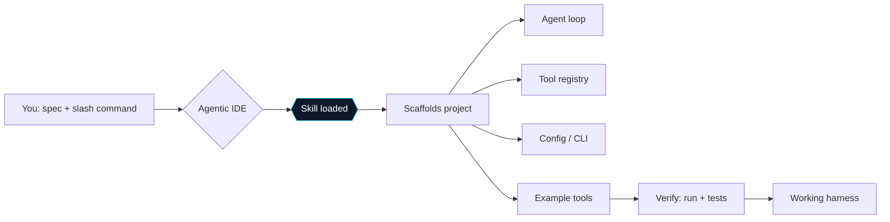
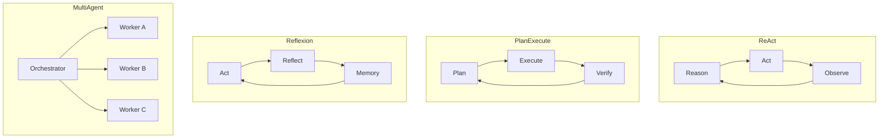

<div align="center">


# 🤖 agent-harness-skills

**A library of IDE skills for scaffolding AI agent harnesses.**

Feed any agentic IDE — [opencode](https://opencode.ai), Claude Code, or similar
— a slash command *plus your spec*, and it generates a complete, runnable
harness in the pattern you ask for. ReAct, plan-and-execute, self-evolving,
reflexion, multi-agent, code agents, RAG memory. One command per pattern.

[](LICENSE)
[](#the-skills)
[](#install)
[](#install)
[](#contributing)

</div>

## How it works

You teach your IDE once (install the skills), then building a harness is a
single command:

```text
"using the harness-react skill, build me an agent that monitors a log directory,
 file an issue when it detects an error spike, with a plan for 10 steps/week"
```

The skill takes over: it scaffolds the whole project — agent loop, tool
registry, config, CLI, example tools — and verifies it runs.



## The skills

| Pattern | Skill name | Claude command | What it scaffolds |
| ------- | ---------- | -------------- | ----------------- |
|  ReAct | `harness-react` | `/react` | Thought → Action → Observation loop (`reason → act → observe` until answer or budget) |
| 🗺️ Plan-and-execute | `harness-plan-execute` | `/plan-and-execute` | Planner → Executor → Verifier pipeline with replanning on failure |
| ♻️ Self-evolving | `harness-self-evolving` | `/self-evolving` | Run → Evaluate → Reflect → Apply: the harness improves its own prompts & tools |
| 🪞 Reflexion | `harness-reflexion` | `/reflexion` | Act → Evaluate → Reflect → Retry with episodic memory of past mistakes (Shinn et al. 2023) |
| 👥 Multi-agent | `harness-multi-agent` | `/multi-agent` | Orchestrator + role-specific workers, parallel dispatch, result synthesis |
| 🧑‍💻 Code agent | `harness-code-agent` | `/code-agent` | Sandboxed coding harness: file edit + shell tools, workspace confinement, blocklists |
| 🧠 RAG / memory | `harness-rag-memory` | `/rag-memory` | Persistent SQLite memory, embeddings, top-k retrieval injected into context |



## Install

Clone the repo, then run `install.sh` (no root needed):

```bash
git clone https://github.com/ArttuAn/agent-harness-skills.git
cd agent-harness-skills
./install.sh                          # global: ~/.config/opencode/skills + ~/.claude/commands
./install.sh --project                # or local: .opencode/skills + .claude/commands
```

`install.sh` spots you: skills land in your opencode config, commands land in
your Claude Code config. Flags for `--opencode-dir` / `--claude-dir` let you
point anywhere. Skip the IDE-level install and just run `install.sh --project`
in any project you want them in.

## Usage

In **opencode**, invoke a skill by name together with your spec:

```text
harness-react: build an agent that answers questions about my wiki, using a
search tool over a sqlite index, max 12 steps, chat mode on
```

In **Claude Code** (after install), the same thing as a slash command:

```text
/react build an agent that answers questions about my wiki, with a search tool
over a sqlite index, max 12 steps, chat mode on
```

Every skill:

- **Asks the pattern up front** — what, input/output, LLM endpoint(s),
  tools, runtime constraints.
- **Scaffolds a complete, idiomatic project** (`pyproject.toml`, src layout,
  env-based config, CLI + chat).
- **Uses only the `openai` SDK plus the Python stdlib** — runs against any
  OpenAI-compatible endpoint (OpenAI, Ollama, vLLM, LM Studio).
- **Verifies** — smoke-runs the harness and checks any generated tests.

## Anatomy of a skill

```text
skills/harness-react/
  SKILL.md          # Pattern theory, step-by-step build, inline code modules
commands/react.md   # Claude Code slash-command edition of the same skill
```

SKILL.md files follow the standard frontmatter contract so both opencode and
Claude Code can load them:

```yaml
---
name: harness-react
description: "Build a ReAct (Reason-Act-Observe) pattern agent harness from a spec"
---
```

## Creating a new skill

Checklist for adding a pattern:

1. Pick a kebab-case `name` (`harness-<pattern>`), one-line `description`.
2. In `SKILL.md`: explain the pattern, then give inline, ready-to-paste
   Python for every module — the agent writes these into the target project.
3. Keep deps minimal (`openai` + stdlib), config env-driven, CLI + chat mode.
4. Add a concise `commands/<pattern>.md` Claude Code edition.
5. Smoke-run the embedded code blocks (they must parse and import clean).

## Contributing

New patterns, better code, tighter verifications — all welcome. Open a PR
against the `main` branch; keep the conventions above and re-verify the
embedded Python before submitting.

## License

[MIT](LICENSE) — do anything you like, attribute politely.